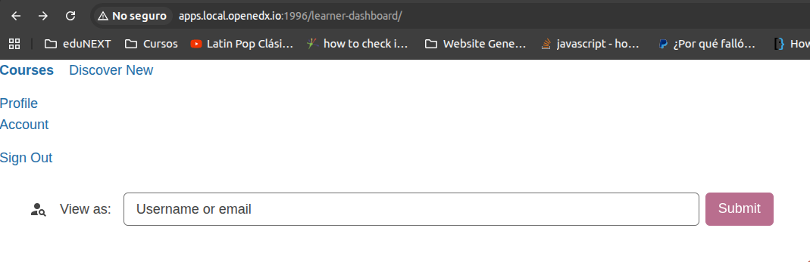

# Header Slot

### Slot ID: `org.openedx.frontend.layout.header_discussions.v1`

### Slot ID Aliases
* `header_slot`

### Props:
* `courseOrg`
* `courseNumber`
* `courseTitle`

## Description

This slot is used to replace/modify/hide the entire discussions header.

## Example

The following `env.config.jsx` will replace the discussions header entirely.



```js
import { DIRECT_PLUGIN, PLUGIN_OPERATIONS } from '@openedx/frontend-plugin-framework';

const config = {
  pluginSlots: {
    'org.openedx.frontend.layout.header_discussions.v1': {
      keepDefault: false,
      plugins: [
        {
          op: PLUGIN_OPERATIONS.Insert,
          widget: {
            id: 'custom_header_component',
            type: DIRECT_PLUGIN,
            RenderWidget: ({ courseOrg, courseNumber, courseTitle }) => (
              <div>
                <p>{courseOrg}</p>
                <p>{courseNumber}</p>
                <p>{courseTitle}</p>
              </div>
            ),
          },
        },
      ]
    }
  },
}

export default config;
```
